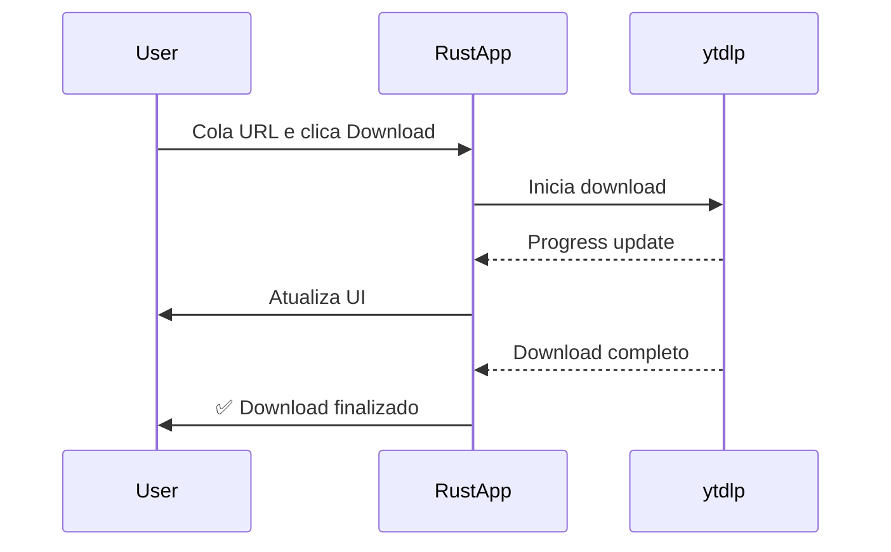

# 📥 Social Media Downloader

> Direção atual (F0, issue #2): o app está migrando para um **binário Rust único** — o backend Python, a camada HTTP, o Docker e as janelas de terminal separadas foram removidos. Detalhes nos GitHub issues #1–#10.

Aplicativo desktop multiplataforma para download de vídeos de redes sociais: um único binário Rust com GUI nativa que executa os downloads diretamente.

## 🗂️ TL;DR

É um **aplicativo desktop para baixar vídeos de redes sociais**, distribuído como um binário Rust único.

### 🏗️ Arquitetura

| Camada | Tecnologia | Função |
|--------|-----------|--------|
| **App** | Rust + [egui](https://github.com/emilk/egui) | GUI nativa (tema preto/amarelo) + downloads diretos em um só processo |

### ⚙️ Como funciona

1. O **app Rust** (`src/main.rs`) abre uma janela nativa 800×600 em um processo único
2. O usuário cola uma URL (YouTube, Instagram, TikTok, Twitter, etc.) no campo de input
3. O app executa o download diretamente e mostra o progresso em tempo real

### ✨ Funcionalidades principais

- 🎬 Downloads de **1000+ sites** via yt-dlp
- 📋 Hotkey global **Win+Shift+X** para capturar URL do clipboard
- 🔒 Suporte a **cookies do navegador** (para vídeos de membros/conteúdo privado)
- 📂 **Abre a pasta** no Explorer após o download
- ⚙️ Configuração de pasta de destino

### 📦 Distribuição

O app é empacotado como um instalador Windows (via `cargo-packager`) a partir do binário Rust único (`social-media-downloader.exe`) — versão atual: **v1.0.14**. (TODO F8: empacotar o sidecar `resources/bin/yt-dlp`.)

---

## ✨ Características

- 🎨 **Interface moderna** com tema preto e amarelo
- 🚀 **Performance nativa** com Rust + egui
- 📦 **1000+ sites suportados** (YouTube, Instagram, TikTok, Twitter, Facebook, etc.)
- 💻 **Multiplataforma**: Windows, Linux, macOS
- 📊 **Tracking em tempo real** de progresso e velocidade
- 📁 **Organização automática** por plataforma

## 🏗️ Arquitetura

```
┌─────────────────────────────────┐
│   App único (Rust + egui)       │
│  - GUI nativa                   │
│  - Clipboard & hotkeys          │
│  - Downloads diretos (yt-dlp)   │
└─────────────────────────────────┘
```

## 📋 Pré-requisitos

- Rust 1.70+
- Cargo
- Nenhum Python é necessário.

## 🚀 Instalação Rápida

### Windows

```powershell
# Instalar Rust
winget install Rustlang.Rustup

# Após instalar, execute o starter unificado (Recomendado)
.\start.bat
```

> [!TIP]
> O `start.bat` cuida do setup automaticamente e roda o app em um processo único.

### Linux/Mac

```bash
# Rust
curl --proto '=https' --tlsv1.2 -sSf https://sh.rustup.rs | sh

# Após instalar, execute o starter unificado (Recomendado)
chmod +x start.sh
./start.sh
```

> [!TIP]
> O `start.sh` automatiza o setup e roda o app em um processo único.

## 🚀 Como Iniciar

A forma mais fácil de começar é usando os scripts de inicialização na raiz do projeto:

### Windows
Basta executar `start.bat` e escolher "Rodar o app".

### Linux/Mac
Execute `./start.sh` (após o `chmod +x`).

## 💻 Uso (Manual)

Se preferir rodar diretamente:

```bash
cargo run
```

### Como Usar o App

1. **Inicie o app** com `cargo run`
2. **Cole uma URL** de vídeo no campo de input
3. **Clique em "Download"** e aguarde
4. **Acompanhe o progresso** em tempo real
5. **Encontre seus vídeos** em `~/Downloads/SocialMediaDownloader/{plataforma}/`

## 🎯 Plataformas Suportadas

- ✅ YouTube
- ✅ Instagram
- ✅ TikTok
- ✅ Twitter / X
- ✅ Facebook
- ✅ Reddit
- ✅ Twitch
- ✅ Vimeo
- ✅ Dailymotion
- ✅ **1000+ outros sites** via yt-dlp

## 📁 Estrutura do Projeto

```
SocialMediaDownloader/
│
├── src/                          # 🦀 App Rust
│   ├── main.rs                   # Entry point
│   ├── api/
│   │   ├── client.rs            # Download client (sem camada HTTP externa)
│   │   └── models.rs            # Modelos internos
│   └── ui/
│       ├── app.rs               # Main GUI app
│       └── theme.rs             # Black/yellow theme
│
├── Cargo.toml                    # Rust dependencies
├── setup.bat                     # Windows setup script
├── setup.sh                      # Linux/Mac setup script
└── README.md                     # This file
```

## 🎨 Design - Tema Preto e Amarelo

### Paleta de Cores

```
Background:
- Primary:   #1a1a1a (Preto suave)
- Secondary: #2d2d2d (Cinza escuro)
- Dark:      #000000 (Preto puro)

Acentos:
- Primary:   #ffd700 (Dourado)
- Light:     #ffed4e (Amarelo claro)
- Dark:      #ffb700 (Dourado escuro)

Texto:
- Primary:   #ffffff (Branco)
- Secondary: #c8c8c8 (Cinza claro)
- Disabled:  #787878 (Cinza médio)
```

## 📊 Onde os Vídeos São Salvos

```
~/Downloads/SocialMediaDownloader/
├── youtube/          # Vídeos do YouTube
├── instagram/        # Vídeos do Instagram
├── tiktok/          # Vídeos do TikTok
├── twitter/         # Vídeos do Twitter
└── outros/          # Outras plataformas
```

## 🔌 API interna

A antiga API REST em Python foi removida em F0: o app é um binário Rust único e os downloads acontecem no próprio processo (detalhes nos GitHub issues #1–#10).

## 🔄 Fluxo de Download



## 🛠️ Desenvolvimento

### Build Release (Rust)

```bash
cargo build --release
```

O executável estará em `target/release/social-media-downloader`

## 🔧 Configuração

As configurações são salvas em `config.json` na pasta do app:

```json
{
  "default_path": "C:/Users/Usuario/Downloads/SocialMediaDownloader",
  "platform_paths": {
    "youtube": "D:/Videos/YouTube"
  },
  "temporary": false
}
```

## 📈 Status do Projeto

| Componente | Status | Completude |
|------------|--------|------------|
| App Rust (binário único) | 🚧 Em migração (issues #1–#10) | — |
| GUI Tema | ✅ Completo | 100% |
| Progress Tracking | ✅ Completo | 100% |
| Hotkeys | ⏳ Pendente | 0% |
| Settings UI | ⏳ Pendente | 0% |
| Clipboard | ⏳ Pendente | 0% |

## ⚠️ Troubleshooting

### Rust não instalado

Se `cargo check` falhou ou o script de setup alertou sobre Rust:

**Windows:**
```powershell
winget install Rustlang.Rustup
```

**Linux/Mac:**
```bash
curl --proto '=https' --tlsv1.2 -sSf https://sh.rustup.rs | sh
```

Após a instalação, **reinicie o terminal** e execute `setup.bat` ou `setup.sh` novamente.

### Erro ao baixar vídeo

- Confirme que a URL é válida
- Verifique conexão com internet
- Algumas plataformas podem ter restrições regionais

### Frontend não compila

```bash
# Atualize o Rust
rustup update

# Limpe o cache
cargo clean

# Tente novamente
cargo build
```

## 🎯 Próximos Passos

### Features Pendentes

- [ ] **Global Hotkey** (Win+Shift+X) usando `global-hotkey` crate
- [ ] **Clipboard Monitoring** automático
- [ ] **Settings Panel** no frontend
- [ ] **File Browser** para escolher pasta de download
- [ ] **Download History** persistente
- [ ] **Platform Icons** na lista de downloads
- [ ] **Drag & Drop** de URLs

### Melhorias Sugeridas

- [ ] Autenticação para sites privados
- [ ] Download de playlists completas
- [ ] Seleção de qualidade (720p, 1080p, 4K)
- [ ] Conversão de formatos
- [ ] Tema claro como opção
- [ ] Notificações do sistema
- [ ] Tradução para outros idiomas

## 🏆 Features Implementadas

### App (Rust + egui)

✅ **Interface Gráfica** - Tema preto/amarelo customizado  
✅ **Componentes UI** - Input, botões, progress bars  
✅ **Real-time Updates** - Atualização automática de progresso  
✅ **Error Handling** - Tratamento robusto de erros  

## 📄 Licença

Este projeto está licenciado sob a [Licença MIT](LICENSE). Consulte o arquivo `LICENSE` para mais detalhes.

## 🤝 Contribuindo

Contribuições são bem-vindas! Sinta-se livre para abrir issues e pull requests.

---

**Desenvolvido com ❤️ usando Rust**

**Projeto pronto para uso! 🚀**
