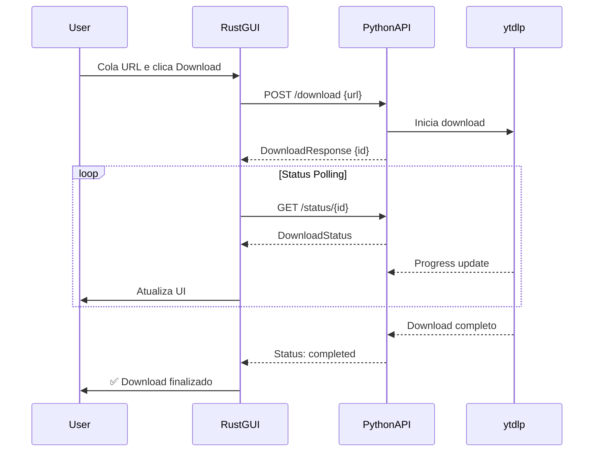

# 📥 Social Media Downloader

Aplicativo desktop multiplataforma para download de vídeos de redes sociais com **arquitetura híbrida**: GUI nativa em Rust + Backend REST API em Python.

## 🗂️ TL;DR

É um **aplicativo desktop para baixar vídeos de redes sociais**, com uma arquitetura híbrida Rust + Python.

### 🏗️ Arquitetura

| Camada | Tecnologia | Função |
|--------|-----------|--------|
| **Frontend** | Rust + [egui](https://github.com/emilk/egui) | GUI nativa, tema preto/amarelo |
| **Backend** | Python + FastAPI + yt-dlp | REST API que executa os downloads |
| **Comunicação** | HTTP REST (localhost:8000) | Frontend chama o backend via API |

### ⚙️ Como funciona

1. O **frontend Rust** (`src/main.rs`) abre uma janela nativa 800×600
2. Ao iniciar, tenta conectar ao backend Python. Se não estiver rodando, **lança o `smd-backend.exe` automaticamente** em uma nova janela do terminal
3. O usuário cola uma URL (YouTube, Instagram, TikTok, Twitter, etc.) no campo de input
4. O frontend envia a URL via `POST /download` para o **backend FastAPI**
5. O backend usa o **yt-dlp** para baixar o vídeo
6. O frontend faz polling a cada 500ms no endpoint `GET /status/{id}` para mostrar progresso em tempo real

### ✨ Funcionalidades principais

- 🎬 Downloads de **1000+ sites** via yt-dlp
- 📋 Hotkey global **Win+Shift+X** para capturar URL do clipboard
- 🔒 Suporte a **cookies do navegador** (para vídeos de membros/conteúdo privado)
- 📂 **Abre a pasta** no Explorer após o download
- ⚙️ Configuração de pasta de destino
- 🔄 Auto-atualização do yt-dlp via endpoint `/yt-dlp/update`
- 🔁 Reconexão automática ao backend a cada 5 segundos se perder conexão
- 🐋 Suporte a **Docker** para o backend

### 📦 Distribuição

O app é empacotado como um instalador Windows (via `cargo-packager`) que inclui tanto o executável Rust (`social-media-downloader.exe`) quanto o backend compilado (`smd-backend.exe`) — versão atual: **v1.0.14**.

---

## ✨ Características

- 🎨 **Interface moderna** com tema preto e amarelo
- 🚀 **Performance nativa** com Rust + egui
- 🐍 **Backend poderoso** com Python + FastAPI + yt-dlp
- ⚡ **UV Package Manager** - Instalação ultrarrápida de dependências (10-100x mais rápido que pip)
- 📦 **1000+ sites suportados** (YouTube, Instagram, TikTok, Twitter, Facebook, etc.)
- 🐳 **Docker-ready** para deploy fácil
- 💻 **Multiplataforma**: Windows, Linux, macOS
- 📊 **Tracking em tempo real** de progresso e velocidade
- 📁 **Organização automática** por plataforma

## 🏗️ Arquitetura

```
┌─────────────────────────────────┐
│   Frontend (Rust + egui)        │
│  - GUI nativa                   │
│  - Clipboard & hotkeys          │
│  - HTTP client                  │
└────────────┬────────────────────┘
             │ REST API
             │ (HTTP)
┌────────────▼────────────────────┐
│   Backend (Python + FastAPI)    │
│  - yt-dlp integration           │
│  - Download manager             │
│  - Config persistence           │
└─────────────────────────────────┘
```

## 📋 Pré-requisitos

### Backend (Python)
- Python 3.11+
- UV (gerenciador de pacotes ultrarrápido)

### Frontend (Rust)
- Rust 1.70+
- Cargo

### Docker (Opcional)
- Docker
- Docker Compose

## 🚀 Instalação Rápida

### Windows

```powershell
# Instalar Python
winget install Python.Python.3.11

# Instalar Rust
winget install Rustlang.Rustup

# Após instalar, execute o starter unificado (Recomendado)
.\start.bat
```

> [!TIP]
> O `start.bat` oferece um menu para você escolher entre rodar o backend localmente ou via Docker, além de cuidar do setup automaticamente.

### Linux/Mac

```bash
# Python (Ubuntu/Debian)
sudo apt install python3.11

# Nota: UV será instalado automaticamente pelo script de setup

# Rust
curl --proto '=https' --tlsv1.2 -sSf https://sh.rustup.rs | sh

# Após instalar, execute o starter unificado (Recomendado)
chmod +x start.sh
./start.sh
```

> [!TIP]
> O `start.sh` automatiza o setup e permite escolher entre backend local ou Docker.

## 🚀 Como Iniciar

A forma mais fácil de começar é usando os scripts de inicialização na raiz do projeto:

### Windows
Basta executar `start.bat` e escolher se quer rodar o backend localmente ou no Docker.

### Linux/Mac
Execute `./start.sh` (após o `chmod +x`).

## 💻 Uso (Manual)

Se preferir rodar os componentes separadamente:

**Terminal 1 - Backend Python:**
```bash
cd backend

# Criar ambiente virtual e instalar dependências com UV
uv venv venv
# Windows:
venv\Scripts\activate
# Linux/Mac:
source venv/bin/activate
uv sync

python main.py
```

**Terminal 2 - Frontend Rust:**
```bash
cargo run
```

### Opção 2: Backend com Docker

```bash
# Inicie o backend
docker-compose up -d

# Em outro terminal, rode o frontend
cargo run
```

### Como Usar o App

1. **Inicie o backend** (Python local ou Docker)
2. **Inicie o frontend** com `cargo run`
3. **Cole uma URL** de vídeo no campo de input
4. **Clique em "Download"** e aguarde
5. **Acompanhe o progresso** em tempo real
6. **Encontre seus vídeos** em `~/Downloads/SocialMediaDownloader/{plataforma}/`

## 🎯 Plataformas Suportadas

- ✅ YouTube
- ✅ Instagram
- ✅ TikTok
- ✅ Twitter / X
- ✅ Facebook
- ✅ Reddit
- ✅ Twitch
- ✅ Vimeo
- ✅ Dailymotion
- ✅ **1000+ outros sites** via yt-dlp

## 📁 Estrutura do Projeto

```
SocialMediaDownloader/
│
├── backend/                      # 🐍 Backend Python
│   ├── main.py                   # FastAPI application
│   ├── models.py                 # Pydantic models
│   ├── downloader.py             # yt-dlp integration
│   ├── config_manager.py         # Configuration management
│   ├── validators.py             # URL validation
│   ├── pyproject.toml            # Python project config (PEP 621) - Única fonte de verdade para dependências
│   └── Dockerfile                # Docker container
│
├── src/                          # 🦀 Frontend Rust
│   ├── main.rs                   # Entry point
│   ├── api/
│   │   ├── client.rs            # HTTP client
│   │   └── models.rs            # API models
│   └── ui/
│       ├── app.rs               # Main GUI app
│       └── theme.rs             # Black/yellow theme
│
├── Cargo.toml                    # Rust dependencies
├── docker-compose.yml            # Docker orchestration
├── setup.bat                     # Windows setup script
├── setup.sh                      # Linux/Mac setup script
└── README.md                     # This file
```

## 🎨 Design - Tema Preto e Amarelo

### Paleta de Cores

```
Background:
- Primary:   #1a1a1a (Preto suave)
- Secondary: #2d2d2d (Cinza escuro)
- Dark:      #000000 (Preto puro)

Acentos:
- Primary:   #ffd700 (Dourado)
- Light:     #ffed4e (Amarelo claro)
- Dark:      #ffb700 (Dourado escuro)

Texto:
- Primary:   #ffffff (Branco)
- Secondary: #c8c8c8 (Cinza claro)
- Disabled:  #787878 (Cinza médio)
```

## 📊 Onde os Vídeos São Salvos

```
~/Downloads/SocialMediaDownloader/
├── youtube/          # Vídeos do YouTube
├── instagram/        # Vídeos do Instagram
├── tiktok/          # Vídeos do TikTok
├── twitter/         # Vídeos do Twitter
└── outros/          # Outras plataformas
```

## 🔌 API REST

### Endpoints Disponíveis

#### POST /download
Inicia um download
```bash
curl -X POST http://localhost:8000/download \
  -H "Content-Type: application/json" \
  -d '{"url":"https://www.youtube.com/watch?v=dQw4w9WgXcQ"}'
```

**Response:**
```json
{
  "id": "550e8400-e29b-41d4-a716-446655440000",
  "status": "queued",
  "message": "Download iniciado com sucesso"
}
```

#### GET /status/{download_id}
Consulta status do download
```bash
curl http://localhost:8000/status/550e8400-e29b-41d4-a716-446655440000
```

**Response:**
```json
{
  "id": "550e8400-e29b-41d4-a716-446655440000",
  "status": "downloading",
  "progress": 45.2,
  "speed": "2.3 MB/s",
  "eta": "00:12",
  "filename": "Rick Astley - Never Gonna Give You Up.mp4",
  "platform": "YouTube"
}
```

#### GET /config
Retorna configurações atuais

#### POST /config
Atualiza configurações

#### GET /platform
Detecta plataforma de uma URL

## 🔄 Fluxo de Download



## 🛠️ Desenvolvimento

### Build Release (Rust)

```bash
cargo build --release
```

O executável estará em `target/release/social-media-downloader`

### Testar Backend Isoladamente

```bash
# Health check
curl http://localhost:8000/

# Testar download
curl -X POST http://localhost:8000/download \
  -H "Content-Type: application/json" \
  -d '{"url":"https://www.youtube.com/watch?v=dQw4w9WgXcQ"}'
```

## 🐳 Docker

### Build e Run Completo

```bash
docker-compose up --build
```

### Apenas Backend

```bash
cd backend
docker build -t social-media-downloader-backend .
docker run -p 8000:8000 social-media-downloader-backend
```

## 🔧 Configuração

As configurações são salvas em `backend/config.json`:

```json
{
  "default_path": "C:/Users/Usuario/Downloads/SocialMediaDownloader",
  "platform_paths": {
    "youtube": "D:/Videos/YouTube"
  },
  "temporary": false
}
```

## ⚡ UV Package Manager

Este projeto usa **UV**, um gerenciador de pacotes Python ultrarrápido escrito em Rust.

### Por Que UV?

- **Velocidade**: 10-100x mais rápido que pip (~1s vs ~30s)
- **Tecnologia**: Escrito em Rust para performance máxima
- **Cache**: Sistema de cache otimizado e distribuído
- **Lockfile**: Geração automática de lockfiles

### Comandos Comuns

```bash
# Criar ambiente virtual
uv venv venv

# Instalar dependências (sincronizar projeto)
uv sync

# Adicionar pacote específico
uv add nome-pacote

# Listar pacotes instalados
uv tree

# Sincronizar dependências (com uv sync se usar project)
# uv pip install .
```

> [!NOTE]
> O script de setup (`setup.bat` / `setup.sh`) instala UV automaticamente se não estiver presente.

## 📈 Status do Projeto

| Componente | Status | Completude |
|------------|--------|------------|
| Backend Python | ✅ Completo | 100% |
| API REST | ✅ Completo | 100% |
| Download Manager | ✅ Completo | 100% |
| Config Manager | ✅ Completo | 100% |
| Docker | ✅ Completo | 100% |
| Frontend Rust | ✅ Core Completo | 80% |
| GUI Tema | ✅ Completo | 100% |
| HTTP Client | ✅ Completo | 100% |
| Progress Tracking | ✅ Completo | 100% |
| Hotkeys | ⏳ Pendente | 0% |
| Settings UI | ⏳ Pendente | 0% |
| Clipboard | ⏳ Pendente | 0% |

## ⚠️ Troubleshooting

### Rust não instalado

Se `cargo check` falhou ou o script de setup alertou sobre Rust:

**Windows:**
```powershell
winget install Rustlang.Rustup
```

**Linux/Mac:**
```bash
curl --proto '=https' --tlsv1.2 -sSf https://sh.rustup.rs | sh
```

Após a instalação, **reinicie o terminal** e execute `setup.bat` ou `setup.sh` novamente.

### Backend não conecta

1. Verifique se Python 3.11+ está instalado: `python --version`
2. Ative o ambiente virtual
3. Instale dependências: `uv sync` (na pasta backend)
4. Inicie: `python backend/main.py`
5. Confirme que está rodando em `http://localhost:8000`

### UV não encontrado

**Windows:**
```powershell
powershell -ExecutionPolicy ByPass -c "irm https://astral.sh/uv/install.ps1 | iex"
```

**Linux/Mac:**
```bash
curl -LsSf https://astral.sh/uv/install.sh | sh
```

Após instalação, reinicie o terminal ou adicione ao PATH:
```bash
export PATH="$HOME/.cargo/bin:$PATH"
```

### Erro ao baixar vídeo

- Confirme que a URL é válida
- Verifique conexão com internet
- Algumas plataformas podem ter restrições regionais
- Verifique se o backend está respondendo

### Frontend não compila

```bash
# Atualize o Rust
rustup update

# Limpe o cache
cargo clean

# Tente novamente
cargo build
```

## 🎯 Próximos Passos

### Features Pendentes

- [ ] **Global Hotkey** (Win+Shift+X) usando `global-hotkey` crate
- [ ] **Clipboard Monitoring** automático
- [ ] **Settings Panel** no frontend
- [ ] **File Browser** para escolher pasta de download
- [ ] **Download History** persistente
- [ ] **Platform Icons** na lista de downloads
- [ ] **Drag & Drop** de URLs

### Melhorias Sugeridas

- [ ] Autenticação para sites privados
- [ ] Download de playlists completas
- [ ] Seleção de qualidade (720p, 1080p, 4K)
- [ ] Conversão de formatos
- [ ] Tema claro como opção
- [ ] Notificações do sistema
- [ ] Tradução para outros idiomas

## 🏆 Features Implementadas

### Backend (Python + FastAPI)

✅ **API REST Completa** - Todos os endpoints funcionando  
✅ **Download Manager** - yt-dlp com progress tracking  
✅ **Config Manager** - Persistência e paths customizados  
✅ **Platform Detection** - Detecção automática e validação  
✅ **Docker Ready** - Container otimizado com ffmpeg  

### Frontend (Rust + egui)

✅ **Interface Gráfica** - Tema preto/amarelo customizado  
✅ **Componentes UI** - Input, botões, progress bars  
✅ **HTTP Client** - Comunicação async com backend  
✅ **Real-time Updates** - Polling e atualização automática  
✅ **Error Handling** - Tratamento robusto de erros  

## 📄 Licença

Este projeto está licenciado sob a [Licença MIT](LICENSE). Consulte o arquivo `LICENSE` para mais detalhes.

## 🤝 Contribuindo

Contribuições são bem-vindas! Sinta-se livre para abrir issues e pull requests.

---

**Desenvolvido com ❤️ usando Rust e Python**

**Projeto pronto para uso! 🚀**
