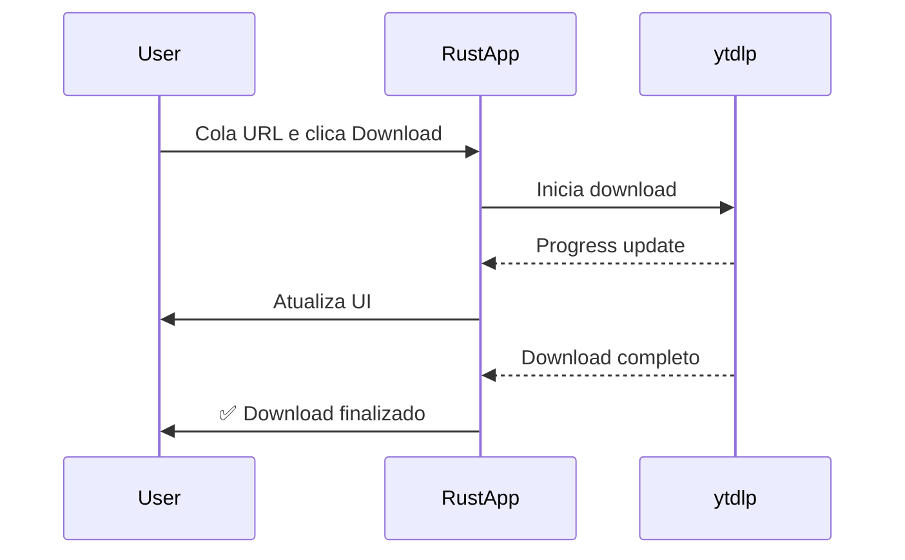

# 📥 Social Media Downloader

> App consolidado como **binário Rust único** (F0–F8, issues #1–#10 fechadas): sem backend Python, sem HTTP localhost, sem Docker, sem janelas de terminal. Interface com sidebar em 6 telas (Vídeo, Transcrição, Canal, Histórico, Console, Configurações), i18n EN-US/PT-BR via arquivos externos e logs integrados na aba Console.

Aplicativo desktop multiplataforma para download de vídeos de redes sociais: um único binário Rust com GUI nativa que executa os downloads diretamente.

## 🗂️ TL;DR

É um **aplicativo desktop para baixar vídeos de redes sociais**, distribuído como um binário Rust único.

### 🏗️ Arquitetura

| Camada | Tecnologia | Função |
|--------|-----------|--------|
| **App** | Rust + [egui](https://github.com/emilk/egui) | GUI nativa (tema preto/amarelo) + downloads diretos em um só processo |

### ⚙️ Como funciona

1. O **app Rust** (`src/main.rs`) abre uma janela nativa 1120×780 em um processo único
2. O usuário cola uma URL (YouTube, Instagram, TikTok, Twitter, etc.) no campo de input (ou aperta **Win+Shift+X** com uma URL no clipboard)
3. O app executa o download diretamente e mostra o progresso em tempo real

### ✨ Funcionalidades principais

- 🎬 Downloads de **1000+ sites** via sidecar yt-dlp (oculto, sem terminal)
- 📄 Transcrições/legendas (SRT/VTT/TXT, com fallback de idioma) — YouTube
- 📺 Lotes por canal com filtro de período
- 📋 Hotkey global **Win+Shift+X** para capturar URL do clipboard
- 📂 **Abre a pasta** no Explorer após o download
- ⚙️ 5 grupos de configuração (downloads, transcrição, app, idioma, sistema/logs)
- 🌍 EN-US/PT-BR trocáveis sem restart (novos idiomas = soltar um `.toml`, sem recompilar)
- 📟 Console integrada com filtros, busca, pause e exportação

### 📦 Distribuição

O app é empacotado como um instalador Windows (via `cargo-packager`) a partir do binário Rust único (`social-media-downloader.exe`) + sidecar `resources/bin/yt-dlp` + `locales/` — versão atual: **v1.0.15**. Sem o sidecar, o app abre normalmente e explica como obtê-lo (`tools/fetch-ytdlp.ps1` ou Configurações → Sistema).

---

## ✨ Características

- 🎨 **Interface moderna** com tema preto e amarelo
- 🚀 **Performance nativa** com Rust + egui
- 📦 **1000+ sites suportados** (YouTube, Instagram, TikTok, Twitter, Facebook, etc.)
- 💻 **Multiplataforma**: Windows, Linux, macOS
- 📊 **Tracking em tempo real** de progresso e velocidade
- 📁 **Organização automática** por plataforma

## 🏗️ Arquitetura

```
┌─────────────────────────────────┐
│   App único (Rust + egui)       │
│  - GUI nativa                   │
│  - Clipboard & hotkeys          │
│  - Downloads diretos (yt-dlp)   │
└─────────────────────────────────┘
```

## 📋 Pré-requisitos

- Rust 1.70+
- Cargo
- Nenhum Python é necessário.

## 🚀 Instalação Rápida

### Windows

```powershell
# Instalar Rust
winget install Rustlang.Rustup

# Após instalar, execute o starter unificado (Recomendado)
.\start.bat
```

> [!TIP]
> O `start.bat` cuida do setup automaticamente e roda o app em um processo único.

### Linux/Mac

```bash
# Rust
curl --proto '=https' --tlsv1.2 -sSf https://sh.rustup.rs | sh

# Após instalar, execute o starter unificado (Recomendado)
chmod +x start.sh
./start.sh
```

> [!TIP]
> O `start.sh` automatiza o setup e roda o app em um processo único.

## 🚀 Como Iniciar

A forma mais fácil de começar é usando os scripts de inicialização na raiz do projeto:

### Windows
Basta executar `start.bat` e escolher "Rodar o app".

### Linux/Mac
Execute `./start.sh` (após o `chmod +x`).

## 💻 Uso (Manual)

Se preferir rodar diretamente:

```bash
cargo run
```

### Como Usar o App

1. **Inicie o app** com `cargo run`
2. **Cole uma URL** de vídeo no campo de input
3. **Clique em "Download"** e aguarde
4. **Acompanhe o progresso** em tempo real
5. **Encontre seus vídeos** em `~/Downloads/SocialMediaDownloader/{plataforma}/`

## 🎯 Plataformas Suportadas

- ✅ YouTube
- ✅ Instagram
- ✅ TikTok
- ✅ Twitter / X
- ✅ Facebook
- ✅ Reddit
- ✅ Twitch
- ✅ Vimeo
- ✅ Dailymotion
- ✅ **1000+ outros sites** via yt-dlp

## 📁 Estrutura do Projeto

```
SocialMediaDownloader/
│
├── src/                          # 🦀 App Rust (padrão MVI)
│   ├── main.rs                   # Entry point
│   ├── hotkey.rs                 # Win+Shift+X global
│   ├── core/                     # state/intent/effect/store (reducer puro)
│   ├── features/                 # video/transcript/channel/history/console/settings + shared sidebar
│   ├── services/                 # traits + yt_dlp sidecar + json_history + log_buffer + autostart
│   ├── i18n/                     # loader/registry (runtime, sem recompilar)
│   ├── storage/                  # config.json versionado
│   └── ui/                       # app shell + theme
│
├── locales/                      # en-US.toml, pt-BR.toml (empacotados; drop-in p/ novos idiomas)
├── resources/bin/                # yt-dlp sidecar (baixado via tools/fetch-ytdlp.*, git-ignored)
├── tools/                        # fetch-ytdlp.ps1/.sh
├── Cargo.toml                    # Rust dependencies
├── setup.bat                     # Windows setup script
├── setup.sh                      # Linux/Mac setup script
└── README.md                     # This file
```

## 🎨 Design - Tema Preto e Amarelo

### Paleta de Cores

```
Background:
- Primary:   #1a1a1a (Preto suave)
- Secondary: #2d2d2d (Cinza escuro)
- Dark:      #000000 (Preto puro)

Acentos:
- Primary:   #ffd700 (Dourado)
- Light:     #ffed4e (Amarelo claro)
- Dark:      #ffb700 (Dourado escuro)

Texto:
- Primary:   #ffffff (Branco)
- Secondary: #c8c8c8 (Cinza claro)
- Disabled:  #787878 (Cinza médio)
```

## 📊 Onde os Vídeos São Salvos

Padrão (alterável em Configurações → Downloads):

```
~/Downloads/SocialMediaDownloader/
├── <canal>/          # com "organizar por canal" (padrão)
└── ...
```

## 💾 Onde o App Guarda Seus Dados

Tudo em `%APPDATA%/SMD/` (Windows):

| Arquivo | Conteúdo |
|---------|----------|
| `config.json` | Todas as preferências (versionado, tolerante a campos novos) |
| `history.json` | Histórico de downloads/transcrições (máx. 500) |
| `logs/YYYY-MM-DD.log` | Logs em JSON lines, só se "salvar logs" ligado (mantém 7 dias) |
| `updates/yt-dlp.exe` | Destino alternativo do sidecar (auto-update) |

## 🌍 Como Adicionar um Idioma

Sem recompilar: copie `locales/en-US.toml` para `locales/<codigo>.toml` (ex: `fr-FR.toml`), traduza os valores e reinicie o app — o idioma aparece no dropdown de Configurações. Chaves ausentes usam o inglês com aviso no Console.

## 📦 Sidecar yt-dlp

Provisione com `tools/fetch-ytdlp.ps1` (ou `.sh` no Linux). No app instalado ele viaja em `bin/` ao lado do exe; a ordem de busca é: `resources/bin/` (dev) → `bin/` ao lado do exe (instalado) → `%APPDATA%/SMD/updates/` → `PATH`. Atualize por Configurações → Sistema → yt-dlp.

## 🔌 API interna

A antiga API REST em Python foi removida em F0: o app é um binário Rust único e os downloads acontecem no próprio processo (detalhes nos GitHub issues #1–#10).

## 🔄 Fluxo de Download



## 🛠️ Desenvolvimento

### Build Release (Rust)

```bash
cargo build --release
```

O executável estará em `target/release/social-media-downloader`

## 🔧 Configuração

As preferências ficam em `%APPDATA%/SMD/config.json` (criado no primeiro uso, com defaults + migração tolerante) e são editadas na tela Configurações: Downloads, Transcrição, Aplicativo, Idioma, Sistema & logs. Mudanças aplicam na hora, sem restart.

## 📈 Status do Projeto

| Componente | Status |
|------------|--------|
| App Rust (binário único, MVI) | ✅ Completo (F0–F8) |
| Telas Vídeo/Transcrição/Canal/Histórico/Console/Configurações | ✅ Completas |
| Hotkey Win+Shift+X + clipboard | ✅ Completo |
| i18n runtime (EN/PT + drop-in) | ✅ Completo |
| Empacotamento (instalador + sidecar + locales) | ✅ Completo |

Limitações conhecidas: sem ícone de bandeja real (toggle persiste; exige crate de tray), sem toast de SO (notificações são in-app), sem suporte a cookies/login (apenas conteúdo público), sem tema claro.

## ⚠️ Troubleshooting

### Rust não instalado

Se `cargo check` falhou ou o script de setup alertou sobre Rust:

**Windows:**
```powershell
winget install Rustlang.Rustup
```

**Linux/Mac:**
```bash
curl --proto '=https' --tlsv1.2 -sSf https://sh.rustup.rs | sh
```

Após a instalação, **reinicie o terminal** e execute `setup.bat` ou `setup.sh` novamente.

### Erro ao baixar vídeo

- Confirme que a URL é válida
- Verifique conexão com internet
- Algumas plataformas podem ter restrições regionais

### Frontend não compila

```bash
# Atualize o Rust
rustup update

# Limpe o cache
cargo clean

# Tente novamente
cargo build
```

## 🎯 Próximos Passos (pós-F8)

- [ ] Ícone de bandeja real (exige crate de tray + integração winit)
- [ ] Suporte a cookies/login (conteúdo privado/membros)
- [ ] Tema claro como opção
- [ ] Notificações do sistema (toast do SO)
- [ ] Virtualização da lista de logs (5000 linhas/frame)

## 🏆 Features Implementadas

### App (Rust + egui)

✅ **Interface Gráfica** - Tema preto/amarelo customizado  
✅ **Componentes UI** - Input, botões, progress bars  
✅ **Real-time Updates** - Atualização automática de progresso  
✅ **Error Handling** - Tratamento robusto de erros  

## 📄 Licença

Este projeto está licenciado sob a [Licença MIT](LICENSE). Consulte o arquivo `LICENSE` para mais detalhes.

## 🤝 Contribuindo

Contribuições são bem-vindas! Sinta-se livre para abrir issues e pull requests.

---

**Desenvolvido com ❤️ usando Rust**

**Projeto pronto para uso! 🚀**
